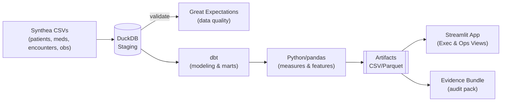
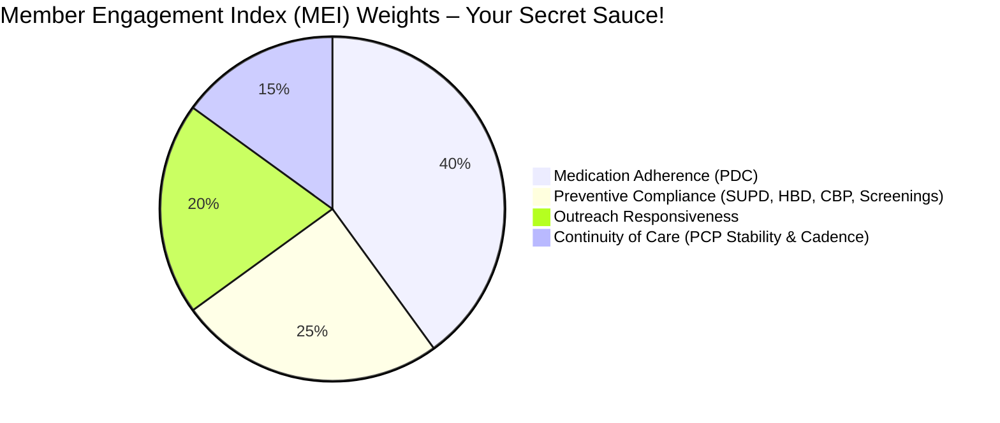
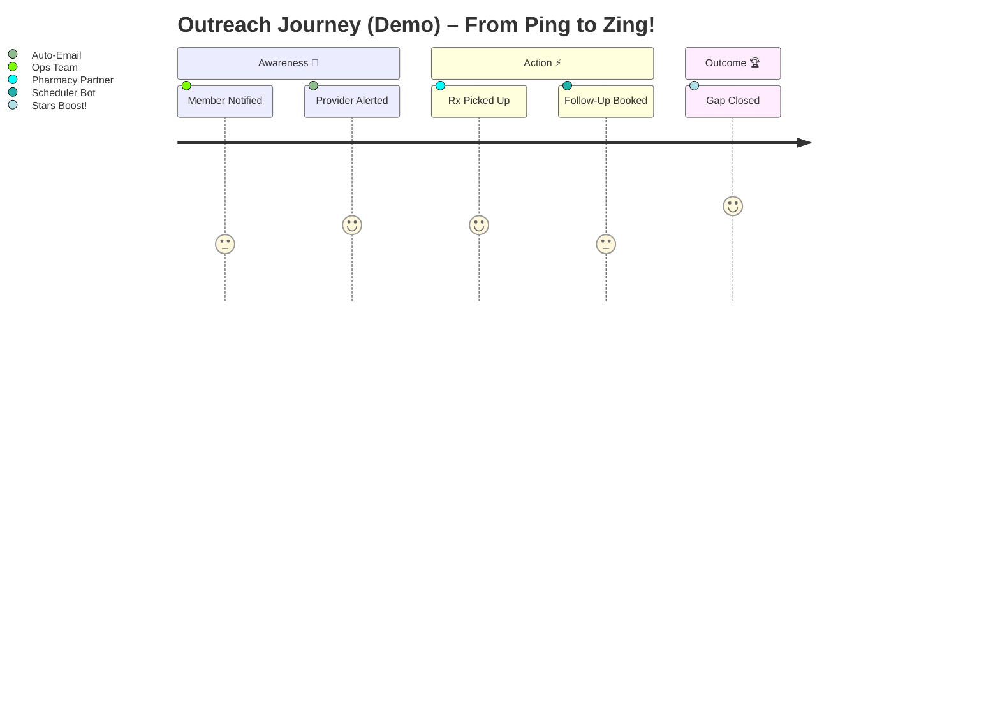

# QMTRY-Provider-Member-Engagement-Analytics
Synthea demo of Stars-ready provider &amp; member engagement analytics with dbt, Great Expectations &amp; Streamlit.

# 🚀 Provider & Member Engagement Analytics — Executive Demo ✨🏥

> 🔥 **Stars in Your Eyes?** Blast off with QMTRY.ai's no-PHI demo that turns Synthea data into actionable gold! Spot Stars gaps, prioritize outreach like a boss, and dazzle auditors with one-click evidence. Execs: In 60 seconds, you'll see revenue lifts, provider MVPs, and adherence wins. Let's make healthcare heroes out of your team! 💪📈

Powered by Synthea (100% synthetic, zero PHI drama) • Crafted by QMTRY.ai for payers and providers chasing CMS Stars glory. Export queues, scorecards, and PDC magic—ready to wow your next board meeting!

## 🎯 What You'll See at a Glance (Exec Cheat Sheet) 👀

Buckle up for insights that pop! Here's the dazzle:

- **Stars Snapshot** ⭐: CBP, HBD control, SUPD, and PDC trends across statins/RASA/diabetes. Clean rollups, sparkly charts—spot lifts in seconds!
- **Prioritized Outreach** 📋: Member queues with "why me?" reason codes (e.g., "SUPD slip-up" or "PDC dip"). Export CSV for your CRM and watch gaps close like magic.
- **Provider Scorecards** 🏆: Rank 'em by engagement, quality velocity, and panel adherence. Peer benchmarks to fuel those "you're crushing it!" convos.
- **PBM Adherence Story** 💊: PDC distributions by class—hunt the low-hanging fruit in the tail for massive ROI.
- **Evidence Bundle** 🔒: Audit-proof zip with data quality checks, lineage, metrics dictionary, logs, and hashes. Skeptics? Hand 'em this and watch jaws drop!

## 🗺️ The Flow (How Value Gets Made – Visual Vibes!) 🔄

Picture this: Raw data zips through a pipeline faster than a caffeinated analyst. Here's the Mermaid magic to impress your tech-savvy execs:



Boom—seamless, scalable, and seriously fun! 🚀

## 📈 Indices & Measures — Transparent, Defensible, and Dazzling! 🌟

We don't hide the math; we flaunt it! Check this pie chart for the Member Engagement Index (MEI)—weights that make sense and drive decisions:



Core Measures (Demo Edition – Exec-Approved Simplicity):
- **CBP Control** 🩸: Last SBP < 140 and DBP < 90 (HTN cohort). Hypertension? Handled!
- **HBD Control** 🍬: Last A1c < 9 (DM cohort). Diabetes drama? Diminished!
- **SUPD** 💊: Statin use in DM cohort. Prevention party starts here!
- **PDC** 📅: Adherent days ÷ window (first fill to year-end), overlap-capped at 0.80 threshold. Adherence? Amped up!

Every formula, weight, and derivation? Zipped in the Evidence Bundle for your auditors' delight. No smoke, just mirrors... of transparency! 😎

And for trends? Imagine this bar chart showing PDC lift over time (sample data vibes—run the demo for real sparks!):

```mermaid
bar
  title PDC Adherence Trends – Watch the Wins Stack!
  x: ["Statins", "RASA", "Diabetes Meds"]
  y: [75, 82, 68]  // Baseline %
  y2: [85, 90, 78] // Post-Outreach Lift %
```

Green bars = growth! Your execs will be charting high-fives. 📊🎉

## 🖥️ What's in the App (Screens That Sizzle!) 💻

Dive into a Streamlit wonderland—dark mode for that late-night strategy sesh:

- **Executive Summary** 📊: Stars rollups, MEI histograms, and quick trends. "Where's the money?" Answered in pixels!
- **Member 360 & Outreach** 🔍: Filter, sort by impact, export CSV. Turn "at-risk" into "all-good" with one click.
- **Provider Lens** 🏅: PES rankings, panel breakdowns, peer benchmarks. Spot stars and coach the rest!
- **Medication Adherence** 📉: PDC histograms + class/contract drills. Target the tail and tally the triumphs.

Visualize the outreach journey with this fun timeline—execs love a good story:



Pro tip: Add confetti animations in Streamlit for extra dazzle. 🎊

## 🔐 Trust, But Verify (The Skeptic Kit – Audit Armor!) 🛡️

We're all about proof in the pudding:
- **Great Expectations Checks** ✅: Row counts, nulls, ranges, integrity—inputs and outputs locked down.
- **dbt Docs & Tests** 📜: Lineage that's clickable and credible for governance gurus.
- **Evidence Bundle (Zip)** 🎁: GE results, metric dictionary, config hash, run logs, artifact checksums. Download and dominate audits!

All powered by Synthea—PHI-free forever. Your compliance officer will sleep like a baby! 😴

## ⚡ Quickstart (1 Minute to Magic – No Cape Required!) 🏃‍♂️

Get dazzling in a dash:

```bash
python -m venv .venv && source .venv/bin/activate   # Windows? .venv\Scripts\Activate.ps1 – Easy!
pip install -r requirements.txt

# Optional: Drop Synthea CSVs into data/synthea_drop/ for custom flair
python scripts/run_pipeline.py --config configs/config.demo.json

# Blast off!
streamlit run app/Home.py
```

Artifacts explode into `output_demo/`:
- `measure_member_results.csv`, `measure_contract_rollup.csv` – Your data dynamite!
- `outreach_queue.csv`, `provider_scores.csv`, `pdc_distributions.csv` – Actionable awesomeness.
- `evidence_bundle.zip` ✅ – Auditor's best friend.

Pro hack: Schedule this on cron for daily dazzle. ⏰

## 🧰 Tech That Scales (And Sparkles!) 🔧

Python (pandas for crunch, DuckDB for speed, Plotly for pretty, Streamlit for shine) • dbt-core for modeling mastery • Great Expectations for quality quests • Optional XGBoost for "will-they-engage?" prophecies.

Mix in your real data? Scales to Snowflake or BigQuery like a champ!

## 🛡️ Security & Compliance (Fort Knox Vibes) 🔒

- **Synthea-Only Demo**: No PHI—play safe, stay compliant.
- **Reproducible Runs**: Configs, checksums, exports—trace every twinkle.
- **HIPAA-Ready Patterns**: Secrets vaulted, CDRs locked, ACLs airtight. Deploy with confidence!

## 🤝 License & Attribution (Share the Sparkle!) 🌟

MIT License © QMTRY, LLC • Synthea © its awesome creators.  
Questions? Open an issue, ping us, or let's collab on your next Stars conquest. We thrive on tough puzzles! 🧩

Ready to dazzle? Fork, run, and watch clients line up! 🚀💼
