# 🚀 Provider & Member Engagement Analytics — Executive Demo ✨🏥

> 🔥 **Stars in Reach?** Blast off with QMTRY.ai's no-PHI demo that turns Synthea data into actionable gold! Spot Stars gaps, prioritize outreach like a pro, and impress auditors with exportable queues, provider scorecards, and PDC magic. Execs: In 60 seconds, see revenue lifts, provider MVPs, and adherence wins. Make healthcare heroes out of ops teams! 💪📈

Powered by Synthea (100% synthetic, zero PHI drama) • Crafted by QMTRY.ai for payers and providers chasing CMS Stars glory.

## 🎯 What to See at a Glance (Exec Cheat Sheet) 👀

Buckle up for insights that pop! Here's the dazzle:

- **Stars Snapshot** ⭐: CBP, HBD control, SUPD, and PDC trends across statins/RASA/diabetes. Clean rollups, sparkly charts—spot lifts in seconds!
- **Prioritized Outreach** 📋: Member queues with "why this?" reason codes (e.g., "SUPD slip-up" or "PDC dip"). Export CSV for CRM and watch gaps close like magic.
- **Provider Scorecards** 🏆: Rank by engagement, quality velocity, and panel adherence. Peer benchmarks to fuel those "crushing it!" convos.
- **PBM Adherence Story** 💊: PDC distributions by class—hunt the low-hanging fruit in the tail for massive ROI.
- **Evidence Bundle** 🔒: Audit-proof zip with data quality checks, lineage, metrics dictionary, logs, and hashes. Skeptics? Hand this over and watch jaws drop!

## 🗺️ The Flow (How Value Gets Made – Visual Vibes!) 🔄

Picture this: Raw data zips through a pipeline faster than a caffeinated analyst. Here's the Mermaid magic to impress tech-savvy execs:


Boom—seamless, scalable, and seriously fun! 🚀

## 📈 Indices & Measures — Transparent, Defensible, and Dazzling! 🌟

No hiding the math; flaunt it! Check this pie chart for the Member Engagement Index (MEI)—weights that make sense and drive decisions:


Core Measures (Demo Edition – Exec-Approved Simplicity):
- **CBP Control** 🩸: Last SBP < 140 and DBP < 90 (HTN cohort). Hypertension? Handled!
- **HBD Control** 🍬: Last A1c < 9 (DM cohort). Diabetes drama? Diminished!
- **SUPD** 💊: Statin use in DM cohort. Prevention party starts here!
- **PDC** 📅: Adherent days ÷ window (first fill to year-end), overlap-capped at 0.80 threshold. Adherence? Amped up!

Every formula, weight, and derivation? Zipped in the Evidence Bundle for auditors' delight. No smoke, just mirrors... of transparency! 😎

And for trends? Imagine this bar chart showing PDC lift over time (sample data vibes—run the demo for real sparks!):

```mermaid
%%{init: {'theme':'dark', 'themeVariables': { 'barFill': '#ff7f0e', 'secondBarFill': '#2ca02c' }}}%%
xychart-beta
    title "PDC Adherence Trends - Watch the Wins Stack!"
    x-axis ["Statins", "RASA", "Diabetes Meds"]
    y-axis "Percentage" 0 --> 100
    bar "Baseline" [75, 82, 68]
    bar "Post-Outreach Lift" [85, 90, 78]
```



Orange bars for baseline, green for growth! Execs will be charting high-fives. 📊🎉

## 🖥️ What's in the App (Screens That Sizzle!) 💻

Dive into a Streamlit wonderland—dark mode for that late-night strategy sesh:

- **Executive Summary** 📊: Stars rollups, MEI histograms, and quick trends. "Where's the money?" Answered in pixels!
- **Member 360 & Outreach** 🔍: Filter, sort by impact, export CSV. Turn "at-risk" into "all-good" with one click.
- **Provider Lens** 🏅: PES rankings, panel breakdowns, peer benchmarks. Spot stars and coach the rest!
- **Medication Adherence** 📉: PDC histograms + class/contract drills. Target the tail and tally the triumphs.

Visualize the outreach journey with this fun timeline—execs love a good story:

```mermaid
journey
  title Outreach Journey (Demo) – From Ping to Zing!
  section Awareness 🎤
    Member Notified: 3: Ops Team
    Provider Alerted: 4: Auto-Email
  section Action ⚡
    Rx Picked Up: 4: Pharmacy Partner
    Follow-Up Booked: 3: Scheduler Bot
  section Outcome 🏆
    Gap Closed: 5: Stars Boost!
```



Pro tip: Add confetti animations in Streamlit for extra dazzle. 🎊

## 🔐 Trust, But Verify (The Skeptic Kit – Audit Armor!) 🛡️

All about proof in the pudding:
- **Great Expectations Checks** ✅: Row counts, nulls, ranges, integrity—inputs and outputs locked down.
- **dbt Docs & Tests** 📜: Lineage that's clickable and credible for governance gurus.
- **Evidence Bundle (Zip)** 🎁: GE results, metric dictionary, config hash, run logs, artifact checksums. Download and dominate audits!

All powered by Synthea—PHI-free forever. Compliance officers will sleep like a baby! 😴

## ⚡ Quickstart (1 Minute to Magic – No Cape Required!) 🏃‍♂️

Get dazzling in a dash:

```bash
python -m venv .venv && source .venv/bin/activate   # Windows? .venv\Scripts\Activate.ps1 – Easy!
pip install -r requirements.txt

# Optional: Drop Synthea CSVs into data/synthea_drop/ for custom flair
python scripts/run_pipeline.py --config configs/config.demo.json

# Blast off!
streamlit run app/Home.py
```

Artifacts explode into `output_demo/`:
- `measure_member_results.csv`, `measure_contract_rollup.csv` – Data dynamite!
- `outreach_queue.csv`, `provider_scores.csv`, `pdc_distributions.csv` – Actionable awesomeness.
- `evidence_bundle.zip` ✅ – Auditor's best friend.

Pro hack: Schedule this on cron for daily dazzle. ⏰

## 🧰 Tech That Scales (And Sparkles!) 🔧

Python (pandas for crunch, DuckDB for speed, Plotly for pretty, Streamlit for shine) • dbt-core for modeling mastery • Great Expectations for quality quests • Optional XGBoost for "will-they-engage?" prophecies.

Mix in real data? Scales to Snowflake or BigQuery like a champ!

## 🛡️ Security & Compliance (Fort Knox Vibes) 🔒

- **Synthea-Only Demo**: No PHI—play safe, stay compliant.
- **Reproducible Runs**: Configs, checksums, exports—trace every twinkle.
- **HIPAA-Ready Patterns**: Secrets vaulted, CDRs locked, ACLs airtight. Deploy with confidence!

## 🤝 License & Attribution (Share the Sparkle!) 🌟

MIT License © QMTRY, LLC • Synthea © its awesome creators.  
Questions? Open an issue or ping QMTRY.ai — hard problems are welcome! 🧩

Ready to dazzle? Fork, run, and watch clients line up! 🚀💼
